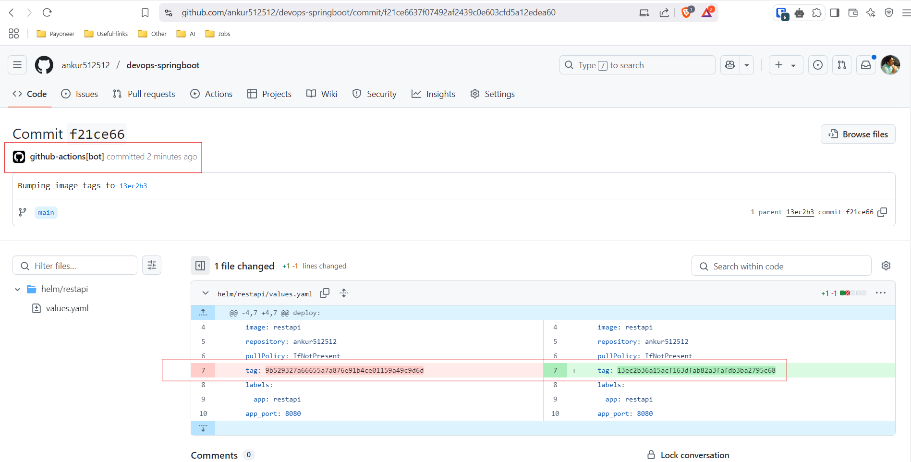

# DevOps Spring Boot Application

This repository contains a Spring Boot application with a complete DevOps setup, including Docker Compose for local development, Helm charts for Kubernetes deployments, Terraform for infrastructure provisioning, and CI/CD pipelines.

## Table of Contents

- [Local Development with Docker Compose](#local-development-with-docker-compose)
- [Kubernetes Deployment with Helm Charts](#kubernetes-deployment-with-helm-charts)
- [Monitoring](#monitoring)
- [CI/CD](#ci-cd)
- [Infrastructure Provisioning with Terraform](#infrastructure-provisioning-with-terraform)
- [Achievements](#achievements)
- [Future improvements](#future-improvements)
- [Known Issue](#known-issue)

---

## Design Decisions

- I have deliberately kept the MySQL DB out of the application helm chart as in real-world scenario we could be using a common Cloud MySQL service for multiple applications including this one.
- For sake of the assignment purposes, we will install MySQL on our k8s cluster using [mysql helm chart from bitnami](https://artifacthub.io/packages/helm/bitnami/mysql) in the further instructions.

## Local Development with Docker Compose

To run the application locally with Docker Compose:

### Prerequisites

- [Docker](https://www.docker.com/get-started)
- [Docker Compose](https://docs.docker.com/compose/install/)

### Steps

1. Clone the repository and cd into it:

   ```bash
   git clone https://github.com/ankur512512/devops-springboot.git
   cd devops-springboot
2. Build and start the services:
   ```bash
   docker compose up --build -d
   ```
    This will build and run the application along with required services like mysql db in the background.
3. Wait till you see all the services in healthy status.
   ```bash
    root@DESKTOP-R3H2LHD:~/personal/repos/devops-springboot# docker ps
    CONTAINER ID   IMAGE                   COMMAND                  CREATED          STATUS                    PORTS                                                 NAMES
    a6fddbb575df   devops-springboot-app   "/__cacert_entrypoin…"   35 seconds ago   Up 23 seconds (healthy)   0.0.0.0:8080->8080/tcp, [::]:8080->8080/tcp           devops-springboot-app-1
    00dde56db445   mysql:8.0               "docker-entrypoint.s…"   35 seconds ago   Up 34 seconds (healthy)   3306/tcp, 33060/tcp                                   devops-springboot-db-1
    ```
4. Test the service using below curl command:

    **GET request**:
    ```bash
    curl localhost:8080/user?id=1
    ```
    You will see result like below:
    ```bash
    Greetings from Crewmeister, Alice!
    ```

    **PUT request**:
    ```bash
    curl -X POST localhost:8080/user \
    -H "Content-Type: application/json" \
    -d '{
          "name": "Ankur Garg"
	    }'
    ```
    You will see result like:
    ```bash
    Greetings from Crewmeister, Ankur Garg!
    ```
5. To shutdown local development environment.
    ```bash
    docker compose down -v
    ```

## Kubernetes Deployment with Helm Charts

### Prerequisites
- [Kubernetes Cluster](https://kind.sigs.k8s.io/docs/user/quick-start/#installing-from-release-binaries)
- [Helm](https://helm.sh/docs/intro/install/)

### Installing local k8s cluster using kind

You can quickly create a local k8s cluster using kind by following these instructions:


- Install kind from here: https://kind.sigs.k8s.io/docs/user/quick-start/#installing-from-release-binaries

- And verify using:

    ```bash
    kind --version
    ```

- Create k8s cluster using:
    ```bash
    kind create cluster
    ```
- Wait till you see all the pods ready:
    ```bash
    root@DESKTOP-R3H2LHD:/var/tmp# kubectl get pods -A
    NAMESPACE            NAME                                         READY   STATUS    RESTARTS   AGE
    kube-system          coredns-668d6bf9bc-9jn2d                     1/1     Running   0          19s
    kube-system          coredns-668d6bf9bc-pls8p                     1/1     Running   0          19s
    kube-system          etcd-kind-control-plane                      1/1     Running   0          23s
    kube-system          kindnet-7djwv                                1/1     Running   0          19s
    kube-system          kube-apiserver-kind-control-plane            1/1     Running   0          23s
    kube-system          kube-controller-manager-kind-control-plane   1/1     Running   0          23s
    kube-system          kube-proxy-nhl9q                             1/1     Running   0          19s
    kube-system          kube-scheduler-kind-control-plane            1/1     Running   0          23s
    local-path-storage   local-path-provisioner-7dc846544d-l8n98      1/1     Running   0          19s
    ```
### Install pre-requisite MySQL DB helm chart

To install the MySQL DB helm chart please use below helm commands:

```bash
helm repo add bitnami https://charts.bitnami.com/bitnami
```
```bash
helm install db-mysql bitnami/mysql --version 12.3.1 \
  --set image.tag=8.0 \
  --set auth.rootPassword=dev \
  --set auth.database=challenge \
  --set primary.persistence.size=1Gi \
  --set primary.service.type=ClusterIP
```

Benefit of using this bitnami helm chart is that it takes care of db replication configuration for us.

Wait for the db pod to get ready:
```bash
root@DESKTOP-R3H2LHD:~/personal/repos/devops-springboot# kubectl get pods db-mysql-0
NAME         READY   STATUS    RESTARTS   AGE
db-mysql-0   1/1     Running   0          69s
```
### Install Application Helm chart

Now let's install our restpi application helm chart.

```bash
helm install restapi helm/restapi --values helm/restapi/values.yaml
```

After the helm release is deployed, wait for application pod to become healthy *(typically takes around `50-60s`)*.

```bash
root@DESKTOP-R3H2LHD:~/personal/repos/devops-springboot# kubectl get pods
NAME                              READY   STATUS    RESTARTS   AGE
db-mysql-0                        1/1     Running   0          5m2s
restapi-deploy-64d886dcfc-x6g5n   1/1     Running   0          94s
```

Now, since we don't have ingress enabled for this assignment purposes, we will use port-forwarding to test our service.

```bash
export SERVICE_NAME=restapi-service
export SERVICE_PORT=$(kubectl get svc --namespace default $SERVICE_NAME -o jsonpath='{.spec.ports[0].port}')
echo "Visit http://127.0.0.1:8080 to use your application"
kubectl --namespace default port-forward svc/$SERVICE_NAME 8080:$SERVICE_PORT
```

Then in another terminal you can use the same curl commands that we used in local development to test the application.

**GET request**:

```bash
curl localhost:8080/user?id=1
```
You will see result like below:
```bash
Greetings from Crewmeister, Alice!
```

**PUT request**:
```bash
curl -X POST localhost:8080/user \
-H "Content-Type: application/json" \
-d '{
        "name": "Ankur Garg"
    }'
```
You will see result like:
```bash
Greetings from Crewmeister, Ankur Garg!
```

Let's keep this helm chart installed for now while we setup monitoring for our applicartion using prometheus.

## Monitoring

As of now, we will only do the infrastructure level monitoring, as I noticed that `/actuator/prometheus` endpoint is not implemented in the code yet.

We will install [kube-prometheus-stack](https://artifacthub.io/packages/helm/prometheus-community/kube-prometheus-stack/) helm chart to install Prometheus as well as Grafana for us.

```bash
helm repo add prometheus-community https://prometheus-community.github.io/helm-charts
```
```bash
helm --namespace monitoring install monitoring prometheus-community/kube-prometheus-stack --create-namespace
```
This will take some time. Wait & verify that all the pods are ready.

```bash
root@DESKTOP-R3H2LHD:~/personal/repos/devops-springboot# kubectl get pods -n monitoring
NAME                                                     READY   STATUS    RESTARTS   AGE
alertmanager-monitoring-kube-prometheus-alertmanager-0   2/2     Running   0          90s
monitoring-grafana-57bd7cc44f-l7c55                      3/3     Running   0          108s
monitoring-kube-prometheus-operator-6ff85f87c5-z7t8c     1/1     Running   0          108s
monitoring-kube-state-metrics-6d79fb6b66-p5bgd           1/1     Running   0          108s
monitoring-prometheus-node-exporter-4jfmt                1/1     Running   0          108s
prometheus-monitoring-kube-prometheus-prometheus-0       2/2     Running   0          90s
```
After that, let's again use port-forwarding for the Grafana UI service.

```bash
kubectl -n monitoring port-forward svc/monitoring-grafana 3000:80
```

Then access the UI from your web-browser: http://localhost:3000/

Use default credentials:

```bash
Username: admin
Password: prom-operator
```

Click on `Dashboards` on the left panel and then select `Kubernetes / Compute Resources / Pod`

Here you can monitor your pod's health.


You can also take a look at other dashboards, if needed.

## CI-CD

### CI

We are using the commit-id as tags for our image. Our github-action bot will [automatically update the image tag](https://github.com/ankur512512/devops-springboot/commit/f21ce6637f07492af2439c0e603cfd5a12edea60) in the [values.yaml](helm/restapi/values.yaml) file with the latest commit-id in the end, to make sure that we are using the latest docker image for our deployment.



***Please note that PR checks and main workflow are configured to run only for changes detected in either `Dockerfile` or inside `app/**` directory as it's not desirable to build & push docker images for other changes.***

Devs can just [create a PR](https://github.com/ankur512512/devops-springboot/pull/2) to the `main` branch which will run a [PR-check](https://github.com/ankur512512/devops-springboot/actions/runs/13883566562/job/38845258258) to build & scan the image for quick feedbacks.

If successful & approved, the PR can be merged to trigger the main workflow which will do below:

- Checkout repo
- Build image
- Run Trivy scan for vulnerabilities
- Login to Dockerhub
- Push image to Dockerhub
- Update Image Version in the HelmChart values.yaml

This updated values.yaml will be picked up by our CD tool in next step.

### CD

Continuous Deployment (CD) can be implemented using [ArgoCD](https://argo-cd.readthedocs.io/en/stable/)

ArgoCD will keep scanning our repo for any changes in the helm chart and will automatically trigger a fresh deployment accordingly.

To install ArgoCD helm chart:

```bash
helm repo add argo https://argoproj.github.io/argo-helm
```
```bash
helm --namespace argocd upgrade --install my-argo-cd argo/argo-cd --version 7.8.11 --create-namespace
```

Then wait for all the pods to get ready:

```bash
root@DESKTOP-R3H2LHD:~/personal/repos/devops-springboot# kubectl get pods -n argocd
NAME                                                           READY   STATUS    RESTARTS   AGE
my-argo-cd-argocd-application-controller-0                     1/1     Running   0          75s
my-argo-cd-argocd-applicationset-controller-5b677d7696-cskq4   1/1     Running   0          75s
my-argo-cd-argocd-dex-server-596bb6bbfc-d87lc                  1/1     Running   0          75s
my-argo-cd-argocd-notifications-controller-78dc47cf6c-7wmpq    1/1     Running   0          75s
my-argo-cd-argocd-redis-5649c96889-hv5zc                       1/1     Running   0          75s
my-argo-cd-argocd-repo-server-6475645777-wqhvm                 1/1     Running   0          75s
my-argo-cd-argocd-server-5f47599db5-nfhd9                      1/1     Running   0          75s
root@DESKTOP-R3H2LHD:~/personal/repos/devops-springboot#
```

Now our ArgoCD tool is installed. Let's connect this to our repository to implement CD for our application.

But before, make sure that you delete our existing application helm chart as we will now be deploying it via ArgoCD. To delete that:

```bash
helm uninstall restapi
```

We have an ArgoCD application manifest ready in our repo. Simply apply the manifest by using:

```bash
kubectl apply -f argocd/restapi.yml
```

You will then notice that our deployment of application has started already.

```bash
root@DESKTOP-R3H2LHD:~/personal/repos/devops-springboot# kubectl apply -f argocd/restapi.yml
application.argoproj.io/restapi created
root@DESKTOP-R3H2LHD:~/personal/repos/devops-springboot# kubectl get pods
NAME                              READY   STATUS    RESTARTS   AGE
db-mysql-0                        1/1     Running   0          54m
restapi-deploy-64d886dcfc-wr75f   0/1     Running   0          8s
root@DESKTOP-R3H2LHD:~/personal/repos/devops-springboot#
```

You can also see the deployment and ArgoCD workflow, live in the UI. Let's again use port-forwarding for that:

```bash
kubectl port-forward service/my-argo-cd-argocd-server -n argocd 9090:443
```

Open the URL and accept the certificate warning: http://localhost:9090

Username is `admin`. 

Fetch the ArgoCD admin password by using:

```bash
kubectl -n argocd get secret argocd-initial-admin-secret -o jsonpath="{.data.password}" | base64 -d
```

Carefully copy the password *(make sure you don't leave behind any special chars in suffix)* and use it in the UI. Once again, our credentials will be:

```
User: admin
Password: <copied-from-the-terminal>
```
You will then see our lovely application deployed here:


Feel free to click on it and have a look around different options.

If the application is ready you can again do the port-forwarding and test it like we did before.


## Infrastructure Provisioning with Terraform

### Disclaimer
I have created the terraform code for this but I don't have any cloud subscription available now, so can't do terraform apply.

But I am fairly confident that it would work, if not, with minor adjustments.

### Prerequisites

- [Terraform](https://developer.hashicorp.com/terraform/tutorials/aws-get-started/install-cli)
- [Google Cloud Subscription](https://console.cloud.google.com/)
- Service account with these roles: Compute Admin, Kubernetes Engine Admin, Service Account User, Storage Admin & Storage Object Admin.
- A cloud storage bucket with globally unique name to store our terraform state

### Create Infrastructure

- This terraform apply should create a GKE based k8s cluster including VPC and networking part.
- This will also install Prometheus, ArgoCD and MySQL helm charts.
- We can install our application helm chart as well using this but I have intentionally kept it separate to be controlled by ArgoCD only to keep the infra and application layers separate.

Let's store our google service account key in a file let's say: `/var/tmp/terraform.json`

Then export the below variable:

```bash
export GOOGLE_CREDENTIALS=$(cat /var/tmp/terraform.json)
```

Now, update the [backend.tf](terraform/backend.tf) file with your unique Google cloud bucket name that you created as part of [Prerequisites](#prerequisites-2). 

If you want to use local backend only, or run into some issues, you can delete this file as well and re-initialize the terraform *(make sure to delete `.terraform` directory and `.terraform.lock.hcl` file before re-initializing)*.

Also, update the [terraform.tfvars](terraform/terraform.tfvars) file with your project_id that should be same as in your service account.

Then use the below commands to initialize and run our terraform code:

```bash
terraform -chdir terraform/. init
```
Run plan using:
```bash
terraform -chdir=terraform plan
```
If you're happy with the plan then apply it using:
```bash
terraform -chdir=terraform apply --auto-approve
```

## Achievements

- We have kept the image size minimal by using alpine images and using different build and deploy stages.
- We have used Aqua Trivy to scan our image before pushing it to make sure we keep our application from any vulnerabilities.
- Used least access privilege model to limit the access of the user inside pod and container.
- Also updated the [pom.xml](app/pom.xml#L35-39) file to update tomcat version to fix an existing vulnerability in the application code, found by Trivy Scan.
- Have used [SPOT VMs](https://cloud.google.com/kubernetes-engine/docs/concepts/spot-vms), to keep the cost in check for our Kubernetes cluster.

## Future improvements

- Our application can be configured to scap and expose metrics on `/actuator/prometheus` endpoint for further monitoring.
- Ingress can be enabled for the required services.
- In future, if we want to scale our application to talk to multiple microservices we can use a service-mesh like Istio for better obvservability, traffic management & secure communication.
- Ideally Terraform code should be kept in a different repo. As it's best practice to keep Infra & Application code in separate repos.
- Terraform modules like VPC & GKE can be kept on different repos instead of local, so other teams/projects can use them.

## Known Issue

- Any comments or blank lines are removed in the [values.yaml](helm/restapi/values.yaml) by the github-action bot during the image updater process. More details [here](https://github.com/OpsVerseIO/image-updater-action?tab=readme-ov-file#known-issues)
